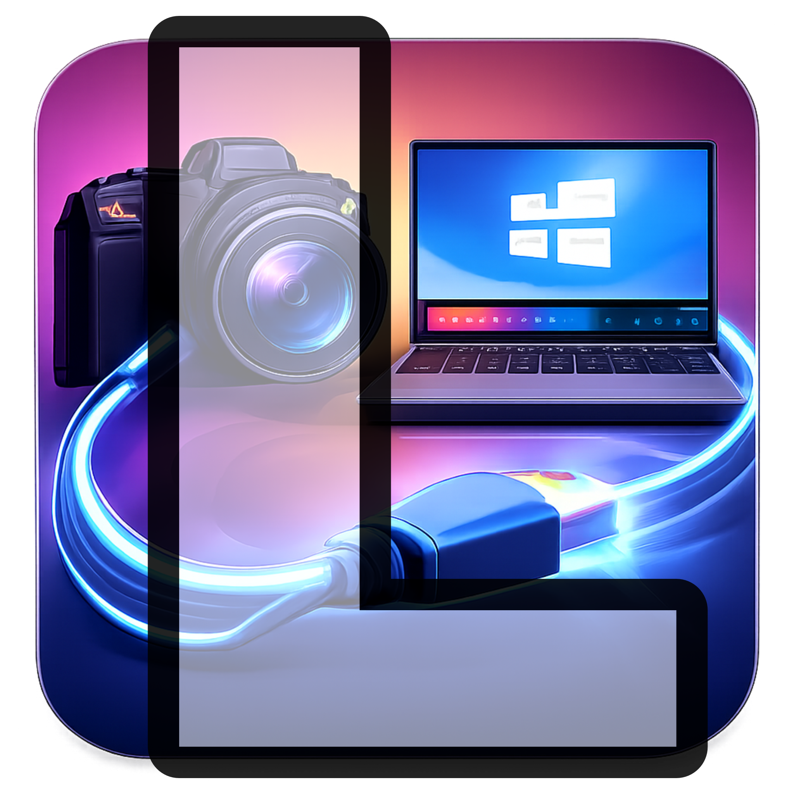
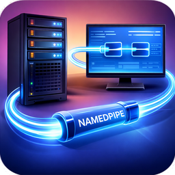
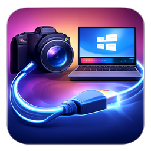
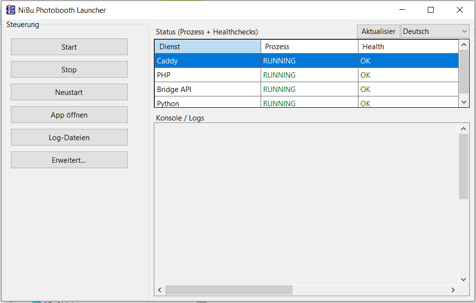
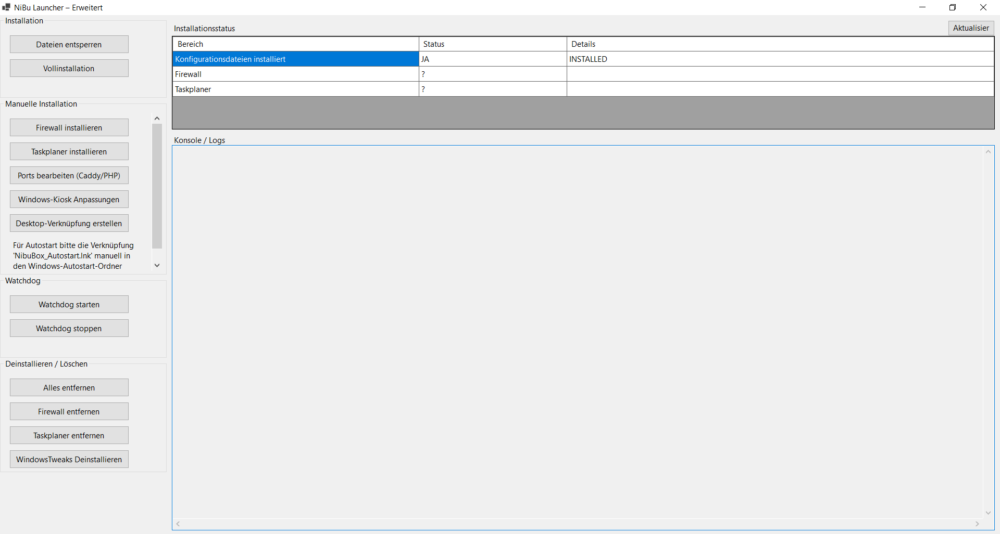
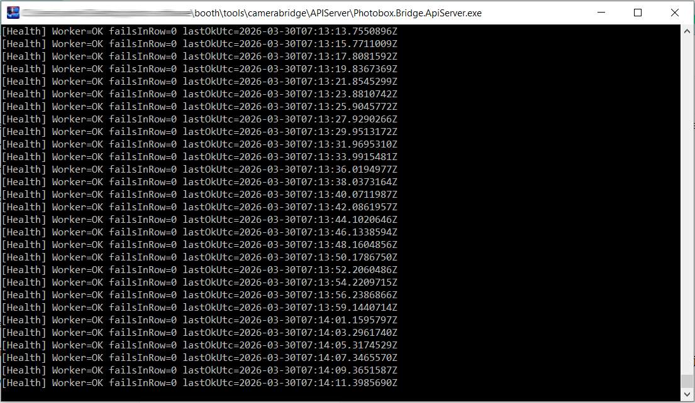
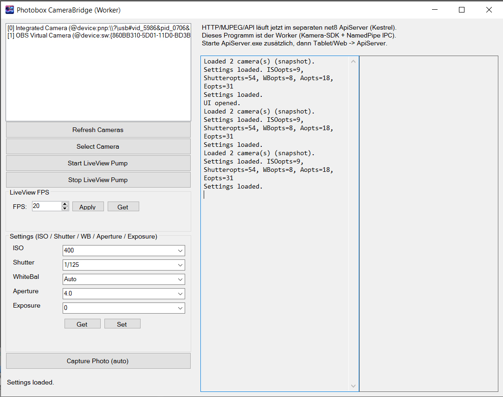

# Photobox CameraBridge


[Deutsch](#deutsch) | [English](#english)

<p align="center">
  
  
  
</p>

---

<a id="deutsch"></a>
# Deutsch

## Überblick

Dieses Repository bündelt die zentralen Komponenten der **Photobox CameraBridge** in einem gemeinsamen Repository:

- **launcher.exe** als zentrale Windows-Oberfläche für Installation, Start, Stop, Monitoring und Wartung
- **ApiServer.exe** als HTTP-/JSON-API mit Swagger / OpenAPI und MJPEG-LiveView
- **worker.exe** als eigentliche Kameraschnittstelle
- **Shared / WorkerIpc** für gemeinsame DTOs, Commands und Named-Pipe-IPC

Der **Launcher** ist die Bedien- und Installationsschicht.  
Der **API-Server** ist die HTTP-Schicht.  
Der **Worker** steuert die Kamera.

## Support

Donate with PayPal ☕
Wenn dir das Projekt hilft und du mir einen Kaffee ausgeben willst:

[](https://www.paypal.me/andreasrottmann92)

## Komponenten auf einen Blick

| Komponente | Aufgabe |
|---|---|
| `launcher.exe` | Installiert und verwaltet die lokale Umgebung, startet Dienste, öffnet die App, zeigt Status und Logs an |
| `ApiServer.exe` | Stellt die HTTP/JSON-API bereit, streamt MJPEG-LiveView und zeigt die API-Dokumentation via Swagger / OpenAPI |
| `worker.exe` | Kapselt die Kamerasteuerung, LiveView, Capture, Settings und Watchdog |
| `Shared` / `WorkerIpc` | Definieren Commands, DTOs, Pipe-Protokoll und die IPC-Schicht |

## Screenshots

| Launcher Allgemein | Launcher Erweitert | API Server | Worker |
|---|---|---|---|
|  |  |  |  |

## Architektur

```text
Launcher / UI / lokale Verwaltung
            │
            ├─ startet / überwacht lokale Dienste
            │
            ├─ Open App → Photobox-App / Weboberfläche
            │
            └─ optionaler technischer Zugriff auf Logs / Setup / Wartung

Web UI / Controller
        ↓ HTTP / JSON
    ApiServer.exe
        ↕ Named Pipe IPC
      worker.exe
        ↕
      Kamera
```

## Repository-Struktur

```text
/src
  /Photobox.Bridge.Launcher
  /Photobox.Bridge.Shared
  /Photobox.Bridge.WorkerIpc
  /Photobox.Bridge.Worker
  /Photobox.Bridge.ApiServer
/images
/icons
/docs
```

## Funktionen

### Launcher

Der Launcher ist die zentrale Windows-Oberfläche für den lokalen Betrieb und das Setup.

Typische Aufgaben:

- **Full Install** für die komplette Einrichtung mit wenigen Klicks
- Dienste **starten**, **stoppen**, **neu starten**
- **Open App** öffnet die Photobox-App / Weboberfläche
- **Open Logs** öffnet den Log-Ordner
- Status für **Caddy**, **PHP**, **Bridge API** und **Python** prüfen
- Firewall-, Task-, Watchdog- und Port-Verwaltung
- Hilfen für Kiosk-Anpassungen und manuellen Autostart

Wichtig: Der Windows-Autostart wird bewusst **nicht automatisch** gesetzt.  
Die Einrichtung erfolgt manuell über die vom Launcher erzeugte Verknüpfung.

### API Server

Der API-Server stellt die HTTP-Schnittstelle des Systems bereit.

Typische Aufgaben:

- HTTP-Requests vom Frontend oder Controller annehmen
- diese in IPC-Commands für den Worker übersetzen
- MJPEG-LiveView streamen
- Status- und Health-Endpunkte bereitstellen
- Worker-Erreichbarkeit überwachen
- Swagger UI / OpenAPI-Dokumentation unter `/docs` bereitstellen

### Worker

Der Worker ist die eigentliche Kamerabrücke.

Typische Aufgaben:

- Kameras suchen und auswählen
- LiveView starten und stoppen
- Frames für den API-Server bereitstellen
- Kamera-Settings lesen und schreiben
- Capture als Datei oder JPEG ausführen
- optionalen USB-/Reconnect-Watchdog steuern

## Gemeinsames Protokoll

Die Kommunikation zwischen API-Server und Worker läuft über **Named Pipe IPC** mit gemeinsamen Commands und DTOs.

Wichtige Command-Gruppen:

- `status.get`
- `cameras.list`
- `camera.select`
- `camera.refresh`
- `liveview.start`
- `liveview.stop`
- `liveview.fps.get`
- `liveview.fps.set`
- `settings.get`
- `settings.set`
- `capture`
- `watchdog.get`
- `watchdog.set`
- `frame.wait_next`

Wichtig:  
Auf Worker-/IPC-Ebene gibt es weiterhin nur den Capture-Command `capture`.  
Die Komfortfunktion **Capture + danach LiveView** wird auf Ebene des API-Servers umgesetzt.

## Quick Start

### Variante A – über den Launcher

1. `launcher.exe` starten
2. optional Sprache wählen
3. **Advanced** öffnen
4. zuerst **Unblock Files** ausführen
5. **Full Install** ausführen
6. zurück ins Hauptfenster
7. **Start** klicken
8. Status prüfen
9. **Open App** nutzen

### Variante B – direkt über API Server + Worker

1. `ApiServer_settings.json` neben `ApiServer.exe` ablegen
2. `Worker.ExePath` korrekt setzen
3. `Bridge.PipeName` zwischen API-Server und Worker abstimmen
4. `worker.exe` und `ApiServer.exe` starten
5. testen:
   - `GET /api/status`
   - `GET /docs`
   - `GET /live.mjpg`

## Typische Standardports

Im Launcher-Umfeld sind typischerweise folgende Ports vorgesehen:

- **Caddy:** `8050`
- **PHP:** `8051`
- **Bridge API:** `8052`
- **Python:** `8053`

Ports sollten nur geändert werden, wenn es dafür einen klaren Grund gibt.

## Repo-Inhalt und Releases

### Repository

Dieses Repository enthält bewusst **nur eigene Projektdateien**.

Externe oder fremde Materialien, gebündelte Drittanbieter-Dateien und sonstiges Fremdmaterial werden bewusst **nicht** in das Repository eingecheckt, damit kein unnötiges Fremdmaterial veröffentlicht wird.

### Releases

Die **Releases** können die vorgesehene, lauffähige Zusammenstellung der Anwendung enthalten, einschließlich der für den Betrieb benötigten Bestandteile, soweit dies im jeweiligen Release vorgesehen und lizenzrechtlich zulässig ist.

Dadurch bleibt das Repository sauber, während Releases als vollständige Pakete für Betrieb, Test oder Deployment genutzt werden können.

## Bilder und Icons im Repository

Diese README verwendet relative Pfade zu den Dateien im Repository:

- `images/launcher1.jpg`
- `images/API-Server.jpg`
- `images/Worker.jpg`
- `icons/launcher-ico.png`
- `icons/api-server-ico.png`
- `icons/worker-ico.png`

## Danksagung / Acknowledgements

Vielen Dank an folgende Projekte und Werkzeuge:

- **digiCamControl** – für Inspiration sowie als Grundlage einzelner Ideen, Daten oder angepasster Abläufe
- **Swagger / OpenAPI** – für die übersichtliche API-Dokumentation und die schnelle technische Übersicht des API-Servers

Hinweis: Einige Daten und Teile des Verhaltens wurden für dieses Projekt angepasst, abgeändert und in den eigenen Ablauf integriert.

## Lizenz

Dieses Projekt steht unter **AGPL-3.0-or-later**.

- SPDX: `AGPL-3.0-or-later`
- Copyright (c) 2026 Andreas Rottmann
- Siehe [`LICENSE`](LICENSE)

Beispielhafter SPDX-Header:

```csharp
// SPDX-License-Identifier: AGPL-3.0-or-later
// Copyright (c) 2026 Andreas Rottmann
```

---

<a id="english"></a>
# English

## Overview

This repository combines the core components of **Photobox CameraBridge** in one shared repository:

- **launcher.exe** as the central Windows UI for installation, start, stop, monitoring and maintenance
- **ApiServer.exe** as the HTTP/JSON API with Swagger / OpenAPI and MJPEG LiveView
- **worker.exe** as the actual camera bridge
- **Shared / WorkerIpc** for common DTOs, commands and Named Pipe IPC

The **launcher** is the operations and setup layer.  
The **API server** is the HTTP layer.  
The **worker** controls the camera.

## Support

Donate with PayPal ☕

[](https://www.paypal.me/andreasrottmann92)

## Components at a glance

| Component | Purpose |
|---|---|
| `launcher.exe` | Installs and manages the local environment, starts services, opens the app, shows status and logs |
| `ApiServer.exe` | Provides the HTTP/JSON API, streams MJPEG LiveView and exposes API docs through Swagger / OpenAPI |
| `worker.exe` | Handles camera control, LiveView, capture, settings and watchdog |
| `Shared` / `WorkerIpc` | Define commands, DTOs, pipe protocol and the IPC layer |

## Screenshots

| Launcher Global | Launcher Advance | API Server | Worker |
|---|---|---|---|
|  |  |  |  |

## Architecture

```text
Launcher / UI / local administration
            │
            ├─ starts / monitors local services
            │
            ├─ Open App → Photobox app / web UI
            │
            └─ optional technical access to logs / setup / maintenance

Web UI / Controller
        ↓ HTTP / JSON
    ApiServer.exe
        ↕ Named Pipe IPC
      worker.exe
        ↕
      Camera
```

## Repository structure

```text
/src
  /Photobox.Bridge.Launcher
  /Photobox.Bridge.Shared
  /Photobox.Bridge.WorkerIpc
  /Photobox.Bridge.Worker
  /Photobox.Bridge.ApiServer
/images
/icons
/docs
```

## Features

### Launcher

The launcher is the central Windows UI for local operation and setup.

Typical tasks:

- **Full Install** for one-click setup
- **start**, **stop** and **restart** services
- **Open App** opens the Photobox app / web UI
- **Open Logs** opens the log folder
- check status for **Caddy**, **PHP**, **Bridge API** and **Python**
- firewall, task, watchdog and port management
- helpers for kiosk tweaks and manual autostart

Important: Windows autostart is intentionally **not set automatically**.  
Setup is done manually through the shortcut created by the launcher.

### API Server

The API server provides the HTTP interface of the system.

Typical tasks:

- accept HTTP requests from the frontend or controller
- translate them into IPC commands for the worker
- stream MJPEG LiveView
- provide status and health endpoints
- monitor worker reachability
- provide Swagger UI / OpenAPI documentation under `/docs`

### Worker

The worker is the actual camera bridge.

Typical tasks:

- discover and select cameras
- start and stop LiveView
- provide frames for the API server
- read and write camera settings
- execute capture as file or JPEG
- manage optional USB / reconnect watchdog behavior

## Shared protocol

Communication between API server and worker uses **Named Pipe IPC** with shared commands and DTOs.

Main command groups:

- `status.get`
- `cameras.list`
- `camera.select`
- `camera.refresh`
- `liveview.start`
- `liveview.stop`
- `liveview.fps.get`
- `liveview.fps.set`
- `settings.get`
- `settings.set`
- `capture`
- `watchdog.get`
- `watchdog.set`
- `frame.wait_next`

Important:  
At worker / IPC level there is still only one capture command: `capture`.  
The convenience flow **capture + then restart LiveView** is implemented at API-server level.

## Quick start

### Option A – via launcher

1. start `launcher.exe`
2. optionally choose the language
3. open **Advanced**
4. run **Unblock Files** first
5. run **Full Install**
6. go back to the main window
7. click **Start**
8. verify the status
9. use **Open App**

### Option B – directly via API Server + Worker

1. place `ApiServer_settings.json` next to `ApiServer.exe`
2. set `Worker.ExePath` correctly
3. make sure `Bridge.PipeName` matches on both sides
4. start `worker.exe` and `ApiServer.exe`
5. test:
   - `GET /api/status`
   - `GET /docs`
   - `GET /live.mjpg`

## Typical default ports

Within the launcher environment, these ports are typically used:

- **Caddy:** `8050`
- **PHP:** `8051`
- **Bridge API:** `8052`
- **Python:** `8053`

Ports should only be changed when there is a clear reason.

## Repository contents and releases

### Repository

This repository intentionally contains **project-owned files only**.

External materials, bundled third-party files and other foreign material are intentionally **not committed** to the repository so that unnecessary third-party content is not published.

### Releases

**Releases** may contain the intended runnable bundle of the application, including required runtime parts where planned for the release and where licensing permits.

This keeps the repository clean while still allowing releases to provide complete packages for operation, testing or deployment.

## Images and icons in the repository

This README uses relative paths to these repository files:

- `images/launcher1.jpg`
- `images/API-Server.jpg`
- `images/Worker.jpg`
- `icons/launcher-ico.png`
- `icons/api-server-ico.png`
- `icons/worker-ico.png`

## Thanks / Acknowledgements

Special thanks to:

- **digiCamControl** – for inspiration and as a basis for selected ideas, data or adapted workflows
- **Swagger / OpenAPI** – for the clear API overview and the interactive documentation layer of the API server

Note: Some data and parts of the behavior were adapted, modified and integrated into this project’s own workflow.

## License

This project is licensed under **AGPL-3.0-or-later**.

- SPDX: `AGPL-3.0-or-later`
- Copyright (c) 2026 Andreas Rottmann
- See [`LICENSE`](LICENSE)

Example SPDX header:

```csharp
// SPDX-License-Identifier: AGPL-3.0-or-later
// Copyright (c) 2026 Andreas Rottmann
```
